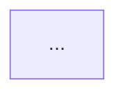

# Diagram Pipeline (draw.io-first, degrade gracefully)

Cách render diagram cho tài liệu MD → docx/markdown. **Mặc định của kit là draw.io** cho flow / process / architecture / BPMN / ERD — giàu shape cho enterprise (swimlane, pool/lane, C4 drill-down, official cloud/K8s icons, output editable) mà Mermaid thiếu. Mermaid chỉ dùng cho diagram-as-code cần render **inline** trong Markdown, hoặc làm fallback. Pipeline degrade gracefully: tier không khả dụng thì rớt xuống tier sau, KHÔNG block export.

## Tier overview

| Tier | Tool | When | Output |
|---|---|---|---|
| 1 (preferred) | `/fis-drawio` → draw.io desktop CLI | Flow/process/architecture/BPMN/ERD, enterprise polish, editable | `.drawio` + PNG/SVG embed vào MD/docx |
| 2 | Figma `generate_diagram` MCP | Stakeholder cần FigJam editable / share URL | FigJam URL + screenshot embed |
| 3 (inline / lightweight) | `mmdc` via `templates/automation/render-diagrams.sh` (Mermaid) | Diagram đơn giản cần render **inline** trong Markdown, hoặc draw.io CLI không có | PNG inline / mermaid block render trên GitHub |
| 4 (degraded) | Embed Mermaid source code | Mọi tier khác fail | Code block, render khi xem MD viewer |

## Tier 1 — draw.io (default for enterprise flows)

Dùng `/fis-drawio`: tạo `.drawio` XML rồi export PNG/SVG và nhúng vào tài liệu. Xử lý swimlane/BPMN pool & lane, C4 có drill-down, ERD crow's-foot, và official AWS/Azure/GCP/K8s icons. Lưu output dưới `docs/<area>/exports/` (vd `docs/system-architecture/exports/context.drawio` + `context.drawio.svg`), nhúng trong Markdown: ``. Nếu draw.io CLI không khả dụng → rớt Tier 2/3 (xem fallback chain trong `/fis-drawio`).

## Tier 3 — Mermaid render script (inline / lightweight / fallback)

```bash
# Prerequisite (one-time): npm install -g @mermaid-js/mermaid-cli
templates/automation/render-diagrams.sh docs/system-architecture.md
# → ./diagrams/system-architecture/d-001.png, d-002.png, ...
```

Exit code 2 = mmdc not installed → escalate Tier 2.
Exit code 3 = ≥ 1 mermaid block failed → check stderr, fix syntax, re-run.

## Tier 2 — Figma generate_diagram MCP

Invoke MCP tool `mcp__claude_ai_Figma__generate_diagram` (verified MCP, FIS env)
khi cần FigJam editable cho stakeholder review.

### Khi nào escalate Tier 1 → Tier 2

- Quy trình > 10 steps → swimlane cần thiết
- Cross-functional với 3+ actors → cần pool/lane
- Stakeholder review meeting → cần shareable FigJam URL
- Khách hàng external review → cần professional polish

### Invocation pattern

Skill (BA/SA) call MCP tool với:

| Param | Value |
|---|---|
| `diagramType` | `flowchart` (process), `sequenceDiagram` (data flow), `erDiagram` (data model), `stateDiagram` (state machine), `gantt` (timeline) |
| `mermaidSource` | Full mermaid block từ artifact MD |
| (optional) | Project Figma file key — paste vào artifact frontmatter `figma_file_key` cho re-edit về sau |

Result: FigJam URL → paste vào §X.Y.4 dưới Mermaid source:

```markdown
#### 5.1.4 Sơ đồ luồng nghiệp vụ

[FigJam editable](https://figma.com/board/...) | Mermaid source bên dưới (canonical)


```

Mermaid source vẫn giữ làm canonical (version-controllable trong git);
FigJam URL chỉ là "view layer" cho stakeholder.

## Tier 3 — bpmn-js HTML artifact

Khi nào escalate Tier 2 → Tier 3:

- Compliance/audit deliverable yêu cầu BPMN 2.0 chuẩn
- Có gateway XOR/AND/OR phức tạp + boundary event
- Cần sub-process / call activity
- Khách hàng bank/insurance/government quen Camunda/Bizagi

### Invocation pattern

1. Copy `templates/automation/bpmn-artifact.template.html` → `docs/diagrams/process-1.html`
2. Mở Camunda Modeler / bpmn.io online → vẽ process → export BPMN 2.0 XML
3. Paste XML vào `bpmnXml` const trong HTML (replace `BPMN_XML_PLACEHOLDER` block)
4. Mở HTML local trong browser → stakeholder xem real BPMN
5. Export SVG via toolbar button → embed vào docx

Note: HTML dùng `https://unpkg.com/bpmn-js@latest` (CDN). Nếu compliance cấm
external load, download bpmn-js bundle về `templates/automation/vendor/` và
update HTML script src.

## Tier 4 — Mermaid source fallback

Mọi tier fail → giữ nguyên mermaid code block trong MD + chú thích:

```markdown
> Note: Diagram render failed automation. Mở MD trong viewer hỗ trợ Mermaid
> (VS Code, GitLab, Obsidian) để xem.
```

## Decision flow

```
PRD/TRD Draft xong với Mermaid source
  ↓
mmdc available?
  ├─ Yes → Tier 1 (PNG inline) → DONE
  └─ No  → Stakeholder cần FigJam editable / share URL?
            ├─ Yes → Tier 2 (Figma MCP) → DONE
            └─ No  → Cần BPMN 2.0 chuẩn?
                      ├─ Yes → Tier 3 (bpmn-js HTML) → DONE
                      └─ No  → Tier 4 (Mermaid fallback) → DONE
```

## Trigger từ skill

Sau khi PRD/TRD Draft xong (skill `/fis-outcome`)
với Mermaid source, skill prompt user qua AskUserQuestion:

> "Render diagrams cho artifact này? [Tier 1 mmdc | Tier 2 FigJam | Tier 3 bpmn-js | Skip (Tier 4)]"

Default = Tier 1 (mmdc). User opt-in Tier 2/3 khi có nhu cầu cụ thể.

## Excalidraw — DEPRECATED

Excalidraw embed KHÔNG còn được hỗ trợ trong FIS pipeline. Lý do:

- Không có Excalidraw MCP verified trong env
- Excalidraw thiên về whiteboard sketch/ideation, không phù hợp BPMN formal
- Figma `generate_diagram` MCP đã thay thế cho FigJam editable use case

Nếu artifact cũ có embed Excalidraw, migrate sang Tier 2 (Figma) hoặc Tier 3 (bpmn-js).

## Reference

- Render script: `templates/automation/render-diagrams.sh`
- BPMN 2.0 template: `templates/automation/bpmn-artifact.template.html`
- Export integration: `claude/skills/fis-docs/references/export-workflow.md`
