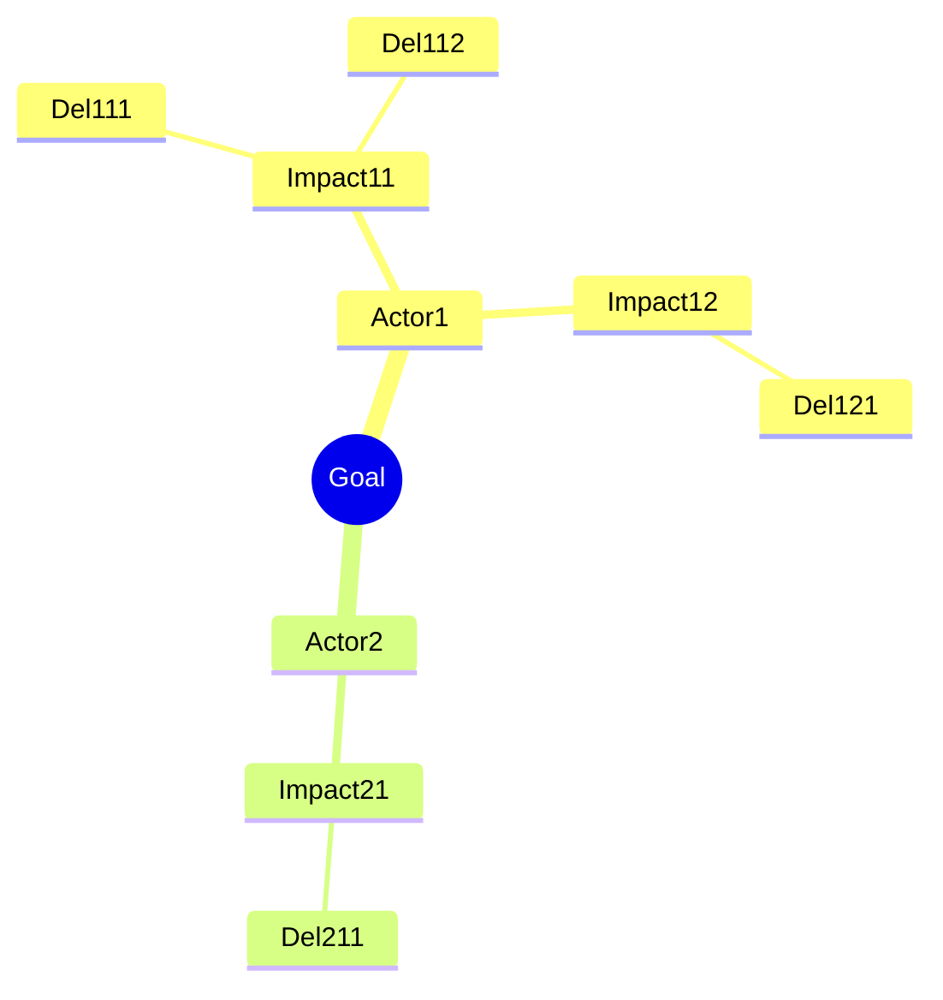

# Mode: impact-map — Impact Mapping tree

## Trigger
"Impact map cho [goal]" / "strategy tree" / "goal decomposition" / "vẽ map từ goal xuống deliverable"

## Khi dùng

- Strategy planning với multi-stakeholder
- Decide what to build từ business goal
- Trace ngược deliverable → goal (justify scope)
- Pre-PRD: clarify "tại sao build feature X" trước khi viết requirement

## Steps

### 1. Auto-assign EL ID

### 2. Define GOAL (top of tree)

AskUserQuestion: "Goal cụ thể (1 câu, quantified, deadline)?"

**Format:** "[Verb] [target metric] từ X lên Y trong [timeframe]."

Bad: "Tăng user retention"
Good: "Tăng user retention 30 ngày từ 45% lên 65% trong Q2 2026"

### 3. Identify ACTORS (who can influence?)

AskUserQuestion: "Ai trực tiếp/gián tiếp ảnh hưởng đến goal này? (User / Internal team / External partner / Anti-actor)"

Vd cho banking onboarding goal:
- Customer (B2C)
- Branch Teller (frontline staff)
- Compliance Officer
- Marketing team
- Anti-actor: Fraud network (cần block)

### 4. For each actor, identify IMPACTS (behavior change)

AskUserQuestion per actor: "Behavior change nào của [actor] sẽ giúp goal đạt? (Pos / Neg)"

Vd Customer:
- Impact 1: Mở account < 5 phút (vs 30 phút trước)
- Impact 2: Tin tưởng app (giảm churn)
- Impact 3: Refer 1 friend trong 30 ngày đầu

### 5. For each impact, identify DELIVERABLES

AskUserQuestion per impact: "Cần build deliverable gì để actor có behavior này?"

Vd Impact "Mở account < 5 phút":
- Deliverable 1: eKYC nhận diện CCCD chip < 30s
- Deliverable 2: Form auto-fill từ data CCCD
- Deliverable 3: OTP single-step thay vì 3-step

### 6. Save tree

Output `docs/elicitation/EL-NNNN-<slug>.md` theo template `references/templates/impact-map.md`:

```markdown
## GOAL
[Quantified statement]

## Tree

GOAL
├── Actor 1
│   ├── Impact 1.1
│   │   ├── Deliverable 1.1.1
│   │   └── Deliverable 1.1.2
│   └── Impact 1.2
│       └── Deliverable 1.2.1
└── Actor 2
    └── Impact 2.1
        └── Deliverable 2.1.1

## Mermaid mindmap



## Priority

Map deliverables → MoSCoW:
- Must (blocking goal)
- Should (high impact, deferrable)
- Could (nice-to-have)
- Won't (out of scope)
```

### 7. Optional feed

Nếu `--feed-to=PRD-NNNN`:
- Deliverables Must → PRD §III.1 FR list
- Impacts → PRD §II.4 Success metrics
- Actors → PRD §IV Personas

## Convergence indicator

- ≥ 1 goal (quantified)
- ≥ 2 actors
- ≥ 2 impacts per actor
- ≥ 1 deliverable per impact
- MoSCoW assigned

## Reference

- `references/templates/impact-map.md`
- Source: Gojko Adzic — impactmapping.org
