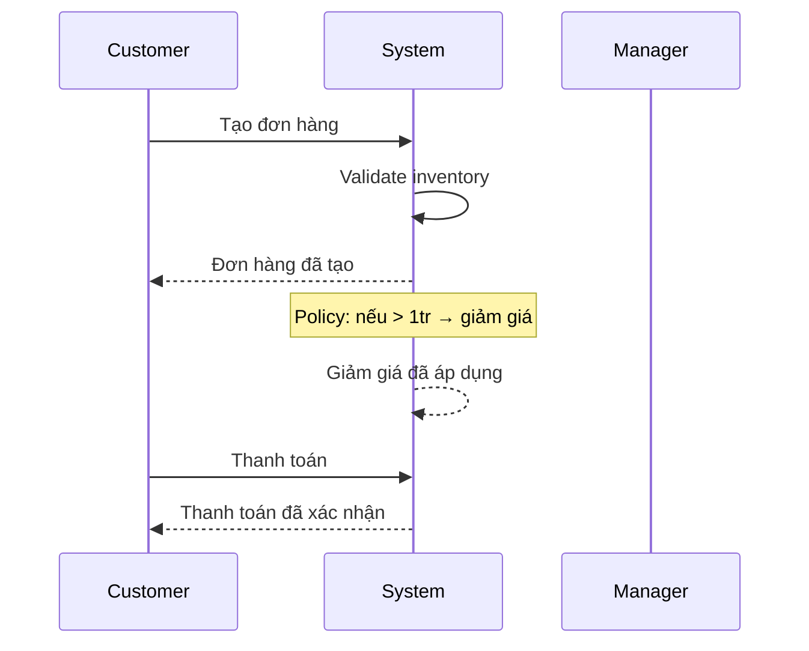

# Event Storming Canvas — {{domain}}

> Workshop format sticky-note simulation. Timeline events → commands+actors → policies → read models.

## 1. Timeline of business events (past tense)

> Sticky cam — events theo thứ tự thời gian.

| # | Event | Notes |
|---|---|---|
| 1 |  |  |
| 2 |  |  |
| 3 |  |  |
| 4 |  |  |
| 5 |  |  |

**Convergence check:** ≥ 5 events identified?

## 2. Commands + Actors

> Sticky xanh — command (present tense) + actor (sticky vàng) gây ra event.

| Actor | Command | → Event |
|---|---|---|
| [Customer] | Tạo đơn | Đơn hàng đã tạo |
|  |  |  |

## 3. Policies (rules)

> Sticky tím — automatic rule.

| Trigger event | Policy (rule) | Result event |
|---|---|---|
| Đơn hàng đã tạo | Nếu amount > 1tr → áp dụng giảm giá | Giảm giá đã áp dụng |
|  |  |  |

## 4. Read Models (data views)

> Sticky vàng — data view stakeholder cần.

| Read Model | Purpose | Source events |
|---|---|---|
| Báo cáo doanh số ngày | Manager track KPI | Đơn hàng đã tạo, Thanh toán đã xác nhận |
|  |  |  |

## 5. Mermaid sequence preview (auto-generated)

## 6. Bounded contexts identified

> Group events thành domain bounded context.

| Context | Events trong context | Owner team |
|---|---|---|
| Order | Đơn hàng đã tạo, Đơn hàng đã hủy | Order team |
| Payment | Thanh toán đã xác nhận | Payment team |
| Inventory | Kho đã trừ | Warehouse team |

## 7. Hot spots (vấn đề / risk)

> Sticky đỏ — chỗ team không đồng ý / risk / unclear.

- [ ] [Hot spot 1] — risk: ___
- [ ] [Hot spot 2] — escalate: ___

## 8. Insights for downstream

| Insight | Feeds vào |
|---|---|
| Event chains | TRD §V API flow + sequence diagram |
| Commands | Story decomposition (1 command ≈ 1 Story) |
| Policies | TRD §IV business rules |
| Read Models | TRD §VI reporting / dashboard |
| Bounded contexts | TRD §III architecture |

## 9. Follow-up actions

- [ ] Run `/fis-plan --from-event-storm=EL-NNNN` → Epic + Story
- [ ] Cross-check policies với compliance/legal
- [ ] Document hot spots → BG-NNNN cho investigation

## Reference

- Source: Alberto Brandolini — eventstorming.com
