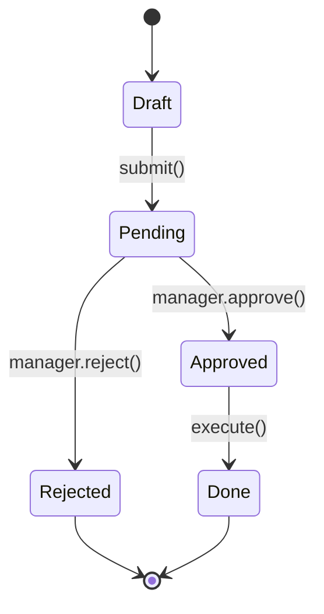

# WF-{{NNNN}}: {{Title}} (Mermaid flow)

## User flow (navigation between screens)

```mermaid
flowchart LR
  L[Login screen]
  D[Dashboard]
  T[{{Action 1}} form]
  C[Confirm OTP]
  S[Success]

  L -->|valid creds| D
  D -->|click {{Action 1}}| T
  T -->|submit| C
  C -->|OTP OK| S
  C -.->|OTP fail 3x| L
```

## State machine (entity lifecycle)



## Convention

- Screen nodes: `[Square brackets]`
- Decision: `{Diamond}` (user flow only)
- Action label: `-->|verb|`
- Failure: `-.->`  dotted
- Initial/final state: `[*]`

## Detail breakdown

### Screens

| Screen ID | Name | Purpose |
|---|---|---|
| L | Login | Authenticate user |
| D | Dashboard | Landing |
| T | Transfer form | Input giao dịch |
| C | Confirm OTP | OTP verification |
| S | Success | Completion |

### Edges (transitions)

| From | To | Action | Condition |
|---|---|---|---|
| L | D | login() | valid creds |
| D | T | click Transfer | (any) |
| T | C | submit() | form valid |
| C | S | verify OTP | OTP correct |
| C | L | redirect | OTP fail 3 lần |

## Notes

- Render via mmdc nếu cần PNG embed cho docx
- Escalate Figma nếu stakeholder cần FigJam editable: `/fis-wireframe figma --mermaid="..."`
- For complex flows > 10 screens, split into multiple sub-flows

## Reference

- Mermaid v11 syntax: https://mermaid.js.org/syntax/flowchart.html
