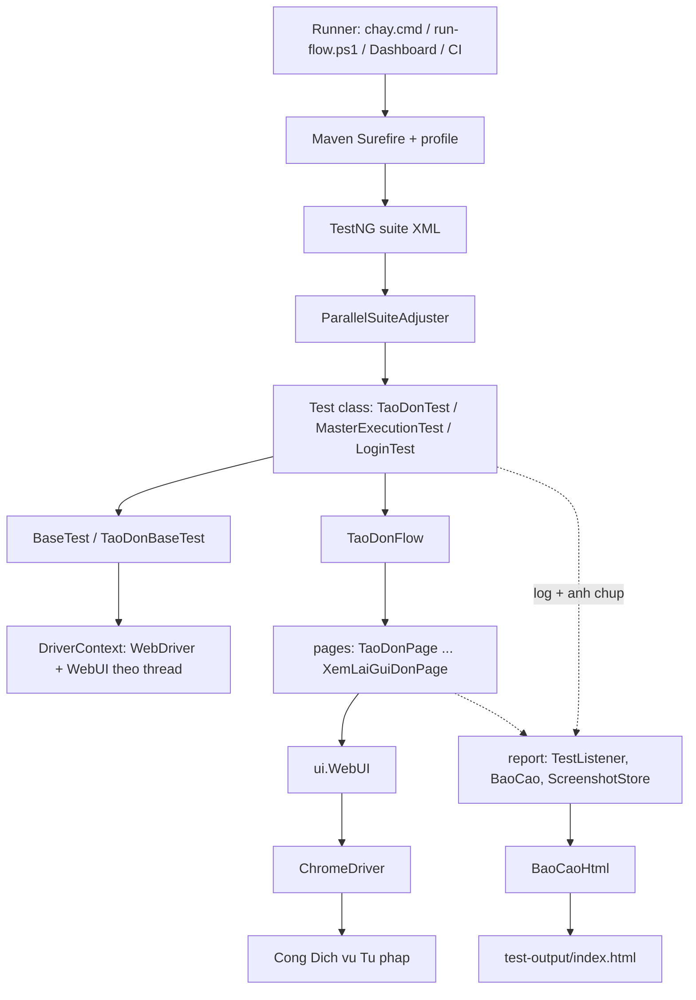
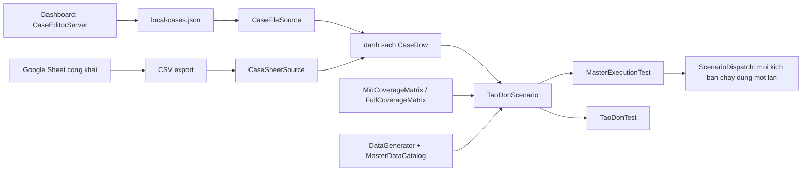
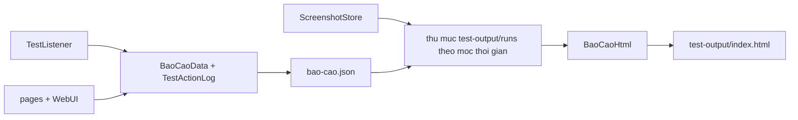

# ToaAn — Kiến trúc hệ thống

Tài liệu này ghi **quyết định và ranh giới kiến trúc**. Mô tả từng file cụ thể nằm ở
[README mục 5](../README.md#5-mô-tả-từng-file-theo-package); bản đồ nhanh ở
[`codebase-summary.md`](codebase-summary.md).

## 1. Chuỗi gọi khi chạy test

Hai điểm dễ hiểu sai, đã ghi trong [README mục 3](../README.md#3-kiến-trúc--luồng-thực-thi):

- `TaoDonFlow.chayTheoMasterConfig` **dừng sớm** theo `run.untilStep` và trả `null`, không đi hết 6 bước.
- Nút **Gửi đơn** không do flow bấm. `MasterExecutionTest` kiểm tra `RunFlowConfig.submit()` rồi mới gọi
  `review.thuGuiDonVaChoKetQua()`. Điều này giữ cho việc gửi đơn thật luôn là một quyết định tường minh.

## 2. Ba nguồn kịch bản

Quyết định nền: **kịch bản là dữ liệu, không phải code**. Case cấu hình (loại đơn, `untilStep`,
ca âm) đi vào Sheet hoặc `local-cases.json`; Java test class chỉ giữ case framework — login,
discovery, unit và ma trận độ phủ. Hệ quả là QA thêm case mà không cần build lại.

`CaseFileSource` validate chặt trước khi chạy: giá trị phải khớp catalog, `untilStep` trong khoảng
hợp lệ, tên field ca âm phải nằm trong whitelist. Dòng sai bị loại kèm lý do thay vì chạy rồi fail
giữa chừng. Schema đầy đủ: [`CASE-SCHEMA.md`](CASE-SCHEMA.md).

## 3. Phân lớp

| Lớp | Package | Trách nhiệm | Không được làm |
|---|---|---|---|
| Test | `tests` | Mô tả kịch bản, assert | Gọi Selenium trực tiếp |
| Flow | `flow` | Điều phối thứ tự bước, quyết định dừng | Biết locator |
| Page Object | `pages` | Layout và locator của **một** màn | Quyết định kịch bản |
| UI | `ui` | Thao tác Selenium cấp thấp, wait, xử lý quirk | Biết nghiệp vụ đơn |
| Data | `data` | Sinh và mô hình hóa dữ liệu, catalog, ma trận | — |
| Config | `config` | Đọc credential và cấu hình luồng chạy | Chứa giá trị secret |
| Core | `core` | Vòng đời WebDriver, song song, bố cục cửa sổ | — |
| Report | `report` | Thu dữ liệu, dựng HTML | Ảnh hưởng kết quả test |
| Case UI | `caseui` | Dashboard cục bộ, sinh đề xuất case, dò Maven | Chạy test trực tiếp trong process |

`WebUI` là **điểm nghẽn có chủ ý**: mọi tương tác Selenium đi qua một lớp duy nhất, nên khi UI đổi
hành vi (toast, chuyển bước, dropdown động) chỉ phải sửa một chỗ. Cái giá là file 4100 dòng —
xem TD-01 trong [`TECH-DEBT.md`](TECH-DEBT.md).

## 4. Cấu hình

Hai bộ đọc cấu hình độc lập, **thứ tự ưu tiên khác nhau** — đây là nguồn nhầm lẫn hay gặp:

| Bộ đọc | Dùng cho | Thứ tự tra |
|---|---|---|
| `ConfigReader` | Credential (`username`, `password`, `baseUrl`) | biến môi trường → system property → `config.properties` |
| `RunFlowConfig` | Cách chạy (suite, số Chrome, `untilStep`, submit, nguồn case) | system property đúng tên → alias `-Dtaodon.*` → env `TOAAN_*` → `run-flow.properties` → mặc định trong code |

Biến môi trường **thắng** file với credential, nhưng **thua** system property với cấu hình chạy.
Bảng khóa đầy đủ của `run-flow.properties`: [README mục 6.2](../README.md#62-srctestresourcesrun-flowproperties--bảng-điều-khiển-chính).

`run-flow.properties` bị đọc hai lần độc lập — một lần bởi `RunFlowConfig` (Java) và một lần bởi
`scripts/run-flow.ps1` (parse text thuần). Thêm khóa mới phải cân nhắc cả hai phía.

Catalog dữ liệu chuẩn nằm ở `src/main/resources/master-data.properties`, được sinh lại từ UI thật
bằng `MasterDataSyncTest` khi danh mục trên cổng thay đổi.

## 5. Dashboard cục bộ

`CaseEditorServer` là HTTP server nhúng (JDK `HttpServer`), mặc định cổng **8787**, khởi động qua
`mvn exec:java` từ menu `scripts/chay.cmd` mục 9.

| Endpoint | Việc |
|---|---|
| `/` | Phục vụ `src/main/resources/case-editor/index.html` (SPA tự chứa, không build step) |
| `/api/catalog` | Danh mục hợp lệ để dựng form chọn |
| `/api/locators` | Quét source Page Object để tra locator |
| `/api/cases` | Đọc/ghi `local-cases.json` |
| `/api/generate-cases` | `TestCaseGenerator` sinh đề xuất theo màn |
| `/api/import-sheet` | Nhập case từ Google Sheet |
| `/api/run`, `/api/run-login` | Ghi `run-flow.properties` rồi spawn Maven qua `MavenResolver` |
| `/report/` | Phục vụ file trong `test-output/` |

Luồng vận hành duy nhất: **Chọn case → Thêm → Lưu → Chạy**. Không có đường tắt ghi đè file rồi chạy
thẳng theo một màn; cả UI lẫn `/api/run` đều chặn khi danh sách case bật rỗng.

`MavenResolver` dò Maven và JDK theo thứ tự: cấu hình tường minh (`run.mavenCmd`) → biến môi trường →
`PATH` → Maven đi kèm IntelliJ → JetBrains Toolbox → thư mục JDK cục bộ. Nhờ vậy máy không cài Maven
trên `PATH` vẫn chạy được. Cùng logic đó được lặp lại trong `scripts/lib-maven.ps1` cho kênh menu.

## 6. Báo cáo

Quyết định: **tự dựng báo cáo thay vì dùng Allure/Extent**. Lý do là báo cáo cần hiển thị thứ mà
framework chung không có — bảng "trường đã nhập" theo từng bước, ảnh chụp tại điểm dừng, và nhãn
tiếng Việt theo 6 bước wizard. Đây là thứ quyết định triage nhanh hay chậm.

Mỗi lượt chạy ghi vào `test-output/runs/<mốc>/bao-cao.json`; `BaoCaoHtml` đọc lịch sử và dựng lại
`index.html`. Số lượt giữ lại theo `taodon.giuLuot` / `RunFlowConfig.keepRuns()`. Giá trị mật khẩu
luôn bị che trong log và báo cáo.

## 7. Xử lý lỗi và song song

| Tình huống | Cơ chế |
|---|---|
| Field bắt buộc không điền được (ẩn/disabled) | `setTextRequired` ném lỗi ngay, nêu tên field |
| Hệ thống chặn đúng như ca âm kỳ vọng | `StepBlockedException` → ca âm PASS |
| Trình duyệt bị đóng giữa chừng | `BrowserClosedException` → Skip, không tính FAIL |
| Chạy song song nhiều Chrome | `ParallelSuiteAdjuster` ép thread-count theo `run.browsers`; `BrowserLayout` chia ô cửa sổ |
| Trùng kịch bản giữa các thread | `ScenarioDispatch` dùng set concurrent, mỗi kịch bản chỉ được claim một lần |
| Timeout | Tập trung ở `WaitConfig`, override được qua `-Dtaodon.wait.scale`, `-Dtaodon.submit.timeoutSec` |

`TaoDonBaseTest` tái dùng một trình duyệt đã đăng nhập cho mỗi thread và khôi phục về Dashboard giữa
các kịch bản, nên chi phí login chỉ trả một lần cho mỗi thread. Đổi lại, lỗi ở một kịch bản có thể
làm bẩn session cho kịch bản kế tiếp trong cùng thread — đó là lý do có bước khôi phục Dashboard.

## 8. Phụ thuộc ngoài

| Thành phần | Cách tích hợp | Ghi chú bảo mật |
|---|---|---|
| Cổng Dịch vụ Tư pháp | HTTP qua ChromeDriver | URL trong `baseUrl`, không hardcode credential |
| Google Sheet | Tải CSV export bằng JDK `HttpClient` | **Không** API key / OAuth / service account. Sheet phải chia sẻ công khai chế độ xem. Cache tại `test-output/cases-sheet-cache.csv` (đã gitignore) |
| Tesseract (Tess4J) | Đọc `src/main/resources/tessdata/eng.traineddata` | Dữ liệu tĩnh, không mạng |
| GitHub Actions | `mvn -B -Punit test` mỗi push/PR | Credential smoke lấy từ GitHub secrets `TOAAN_*`, không có trong repo |

## 9. Ràng buộc đã biết

Những điểm sau là **thực trạng đã đo**, không phải thiết kế mong muốn. Ghi ra để người sửa code
không bất ngờ:

- **Vòng phụ thuộc giữa các package.** `ui.WebUI` import `flow.StepBlockedException` và
  `flow.BrowserClosedException`, trong khi `flow.TaoDonFlow` import `WebUI`. Tương tự `core` ↔ `report`
  (`BaseTest` ↔ `TestListener`) và `config` ↔ `core` (`RunFlowConfig` ↔ `BrowserSlot`).
- **`data.UiMasterDataReader` phụ thuộc ngược lên `pages` và `WebUI`** vì nó cào danh mục từ UI thật.
  Về tên gọi nó thuộc tầng dữ liệu, về thực chất nó là một loại test UI.
- **Page Object import cả `report` và `data`**, nên ngoài việc thao tác màn hình chúng còn ghi log
  hành động và đọc dữ liệu kịch bản.
- **Một số test bỏ qua ranh giới Page Object**: `LoginTest` dùng `WebUI` trực tiếp; `TaoDonTest` và
  `MasterDataSyncTest` import `By`/`Keys` của Selenium.
- **`CaseEditorServer` gộp nhiều việc**: routing HTTP, quét source tìm locator, ghi JSON, sửa
  properties và spawn process Maven.
- **Hai nguồn danh sách field** cho ca âm: `FieldCoverageCatalog` (sinh case) và `CATALOG` riêng
  trong `FieldDiscoverySweepTest` (quét). Thêm field một bên dễ quên bên kia — TD-13.

Mức ưu tiên và hướng xử lý của từng điểm: [`TECH-DEBT.md`](TECH-DEBT.md) (TD-01, TD-04, TD-13) và
[`project-roadmap.md`](project-roadmap.md).
